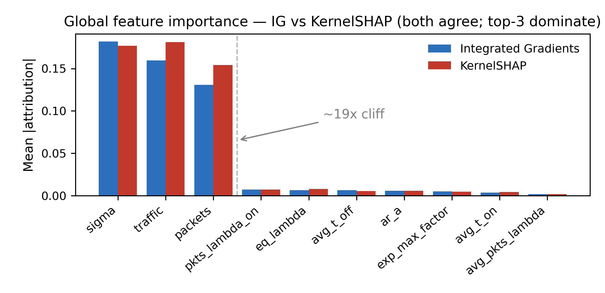
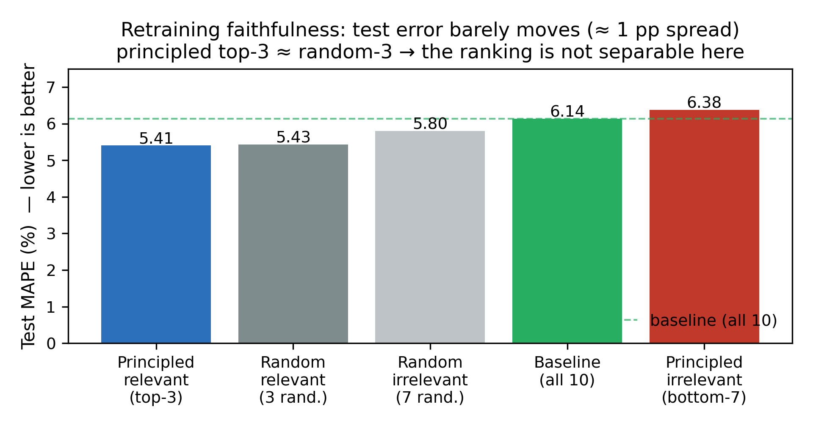
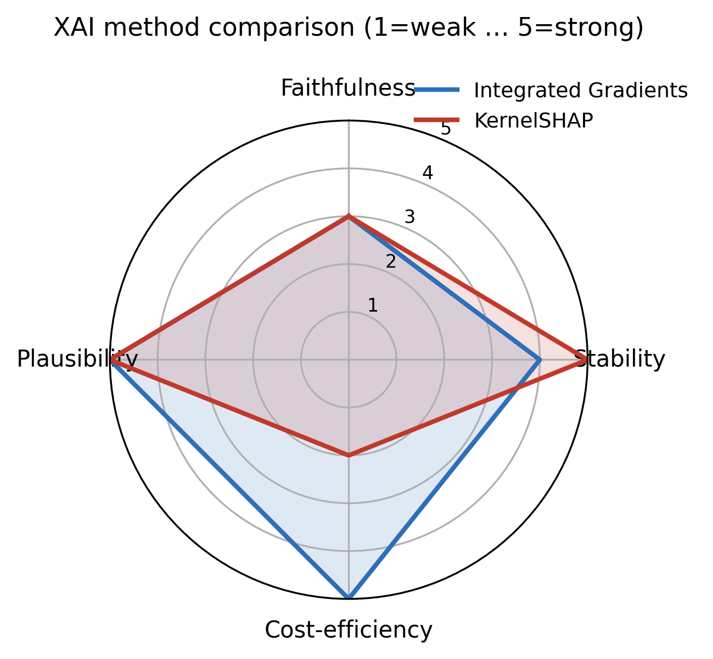

# Comparative Evaluation of XAI Methods for RouteNet-Fermi Delay Prediction
### Integrated Gradients vs. KernelSHAP

**Scope:** two subsections: (A) the evaluation criteria, and (B) the comparative results of the two XAI methods. Detail is included so the content can be lifted directly into the deliverable. Training uses a representative **sample of the dataset** (a fixed subset of simulations) for computational efficiency; the protocol is identical across all compared models, so the relative comparison is valid.

---

## Why delay, and why the traffic-models dataset

Before presenting the XAI methods themselves, it is worth clarifying two upstream choices that define what the study explains: the **prediction task** and the **dataset**. Both are deliberate.

**Why delay (not jitter or packet loss).** RouteNet-Fermi predicts three QoS metrics: delay, jitter, and packet loss. We focus on **delay** for three reasons. First, it has the lowest noise floor and the most reliable training convergence in the BNN-UPC benchmark, which means that differences in how the model uses its inputs are not drowned out by label noise. Second, it has a direct queuing-theory interpretation (delay = queuing delay + transmission delay), which makes the feature attributions physically meaningful rather than purely statistical. Third, it is the paper's primary reported metric (RouteNet-Fermi, Table V), giving a published reference against which our setup was validated.

**Why the traffic-models sub-experiment (not scheduling, scalability, etc.).** The BNN-UPC suite offers several sub-experiments, each varying a different axis such as queue-scheduling policy, topology/scale, and so on. We use **`traffic_models`** because it has the richest per-flow feature set in the suite. Since this study attributes importance to per-flow traffic parameters, only the dataset that actually varies those parameters is meaningful. Sub-experiments that vary scheduling or topology do not exercise the per-flow traffic features we analyse.

**Why the `all_multiplexed` sub-configuration.** Within `traffic_models/delay`, `all_multiplexed` mixes CBR, on/off, autocorrelated, and modulated traffic generators in each scenario. This heterogeneity gives the per-flow features real variance across samples, which is the contrast an XAI attribution needs. A single-generator dataset would leave many features near-constant and the attributions ill-defined.

---

## Scope: which inputs the XAI study explains (10 of RouteNet-Fermi's 22)

RouteNet-Fermi receives, per flow, **22 named input quantities**. They fall into two groups, and the XAI study deliberately targets only the first.

- **10 per-flow path scalars**: continuous, per-flow parameters describing the flow's traffic and its stochastic arrival process. These are the only inputs a feature-importance method can meaningfully rank and a feature-filtering protocol can meaningfully drop, because they are continuous, per-flow, and directly perturbable. **These 10 are the XAI target.**
- **12 structural inputs**: quantities that define the network and the graph the GNN runs on, not the flow's traffic. They are present, unchanged, in every model and every variant. Without them there is no graph for the GNN to operate over, so they are never candidates for removal.

| Input group | Count | Why excluded from the XAI ranking |
|---|---|---|
| `length` | 1 | route length, a graph structure property |
| `model` (traffic type) | 1 | categorical, one-hot (7 bits): not a continuous scalar |
| Link features (capacity, policy) | 2 | per-link, shared across flows: not per-flow traffic |
| Queue features (size, priority, weight) | 3 | device/queue configuration: not a traffic parameter |
| Graph/connectivity tensors | 5 | topology/connectivity: not features |
| **Per-flow path scalars** | **10** | **continuous, per-flow, perturbable traffic parameters: the XAI target** |

The 10 path scalars and their meaning:

| Feature | Meaning |
|---|---|
| `traffic` | flow average bandwidth (offered load) |
| `packets` | packets generated (with `traffic`, gives mean packet size) |
| `eq_lambda` | equivalent (mean) arrival rate of the traffic process |
| `avg_pkts_lambda` | average packet arrival rate |
| `exp_max_factor` | peak/burst factor of the arrival distribution |
| `pkts_lambda_on` | packet rate during the ON state (on/off traffic) |
| `avg_t_on` / `avg_t_off` | average ON / OFF durations (on/off traffic) |
| `ar_a` | autoregressive coefficient (autocorrelated traffic) |
| `sigma` | amplitude / standard deviation of the modulated/AR arrival process, i.e., burstiness |

Restricting attribution and filtering to these 10 keeps the research question well posed: which of the flow's traffic parameters does the model rely on to predict that flow's delay? Graph-structural and queue-level explanations are out of scope here and deferred to future work.

---

## A. Selected Evaluation Criteria

We compare **Integrated Gradients (IG)**, a gradient-based attribution method, and **KernelSHAP**, a perturbation-based (Shapley-value) method, as feature-importance explainers for RouteNet-Fermi's per-flow delay prediction. The two methods are evaluated on four criteria chosen to be both scientific (each is a measurable, reproducible quantity) and critical (each exposes where a method, or the evaluation itself, succeeds or fails).

1. **Faithfulness (fidelity).** Does the importance ranking identify the input features the model genuinely relies on? This is operationalised with a retraining-based, column-dropping protocol: for a relevance threshold k, the per-flow input features are split into a top-k% (`relevant`) and a bottom-(100-k)% (`irrelevant`) set. A model is retrained from scratch on each reduced input, and its test error is compared against a full-feature baseline and against a **random-ranking control** (which isolates the value of the ranking from the value of merely having fewer inputs). This retraining-based design is the ROAR (RemOve And Retrain) methodology (Hooker et al., 2019), which avoids the out-of-distribution confound of inference-only feature removal.

2. **Stability (reproducibility).** How consistent is a method's ranking under resampling? This is measured by the Spearman rank correlation between rankings computed on two independent halves of the explanation set.

3. **Computational cost.** How expensive is one explanation? Measured by the number of model evaluations required per explanation (an implementation-independent measure), with wall-clock reported as a secondary, confounded indicator.

4. **Plausibility (domain consistency).** Are the top-ranked features consistent with queuing-theory expectations for delay? That is, do they correspond to known physical drivers of network delay?

**Method characterization** (for the comparison table/radar):

| Property | Integrated Gradients | KernelSHAP |
|---|---|---|
| Type | Gradient-based | Perturbation-based (Shapley) |
| Feature-correlation handling | Path integral from a baseline; attributions satisfy completeness | Coalition sampling; assumes feature independence in the kernel |
| Dimensionality scaling | Scales with number of interpolation steps (here 50), independent of number of features | Scales with number of perturbations (here 256) to approximate Shapley values |
| Reference / baseline | Training-set median (per feature) | Training-set median as single-reference background |

---

## B. Comparative Results

**What both methods find (the ranking).** IG and KernelSHAP both rank the same three per-flow features at the top: **sigma, traffic, packets**. These are separated from the remaining seven by a sharp **~19x drop** in attribution magnitude (Figure 1). The top-3 carry approximately **93% of the total attribution mass**; the bottom-7 form a flat, near-noise tail. The two methods differ only by an adjacent swap of ranks 1-2 (sigma vs. traffic) that never crosses a threshold boundary, so their top/bottom feature sets are identical at every k. This is what justifies treating them as one set of retrained models in the faithfulness test.

The full per-feature attributions, computed as mean |attribution| over the 300-simulation explanation set (Step 5), make the cliff explicit for both methods:

| Rank (IG) | Feature | IG mean abs attribution | KernelSHAP mean abs attribution |
|---|---|---|---|
| 1 | sigma | 0.182 | 0.177 |
| 2 | traffic | 0.160 | 0.181 |
| 3 | packets | 0.131 | 0.154 |
| 4 | pkts_lambda_on | 0.0070 | 0.0071 |
| 5 | eq_lambda | 0.0065 | 0.0079 |
| 6 | avg_t_off | 0.0064 | 0.0054 |
| 7 | ar_a | 0.0058 | 0.0056 |
| 8 | exp_max_factor | 0.0052 | 0.0047 |
| 9 | avg_t_on | 0.0036 | 0.0043 |
| 10 | avg_pkts_lambda | 0.0018 | 0.0017 |

**How the "~93%" and the "~19x cliff" are derived from this table:**

- *Mass concentrated in the top-3.* Sum of the three leading values divided by the sum of all ten:
  - IG: (0.182 + 0.160 + 0.131) / 0.509 = 0.473 / 0.509 = **92.9%**
  - KernelSHAP: (0.177 + 0.181 + 0.154) / 0.549 = 0.512 / 0.549 = **93.3%**

  So in both methods the three leading features carry approximately 93% of the total attribution mass; the remaining seven share roughly 7%.

- *The cliff.* The ratio between the 3rd and 4th features (in each method's own ranking): IG = 0.131 / 0.0070 = **18.7x**, KernelSHAP = 0.154 / 0.0079 = **19.5x**, giving an average cliff of approximately **19x**, after which the tail is flat (all values below 0.008).



*Figure 1. Global feature importance, IG vs KernelSHAP. Both methods agree, and the top-3 dominate with a ~19x cliff (dashed line marks the cut).*

### B.1 Faithfulness: and a critical limitation of the test on this model

Retraining-based faithfulness was evaluated at k = 30% : the threshold chosen because it isolates exactly the top-3 features, which sit just above the ~19× attribution cliff (Figure 1) and are therefore where any genuine importance signal should be strongest. At k = 30% the 10 per-flow features split into the top-3 (relevant) and the bottom-7 (irrelevant), evaluated for both the principled (IG/KernelSHAP) ranking and the random control. Test MAPE (lower is better), with all models trained identically on the same data sample and evaluated on the same held-out test set:

| Model | Learned features kept | Test MAPE |
|---|---|---|
| Principled `relevant` (top-3: sigma, traffic, packets) | 3 | 5.41% |
| Random `relevant` (3 random features) | 3 | 5.43% |
| Random `irrelevant` (7 random features) | 7 | 5.80% |
| Baseline (all 10 features) | 10 | 6.14% |
| Principled `irrelevant` (bottom-7) | 7 | 6.38% |

**Critical finding.** The retraining test **cannot discriminate** feature importance here, and the reason is structural rather than statistical:

- The top-3 model (5.41%) and a random-3 model (5.43%) are essentially tied: which three features are kept barely changes accuracy.
- The overall spread is only about 1 percentage point (5.41-6.38%) and does not track importance. The full 10-feature baseline (6.14%) is even slightly worse than the 3-feature models on this sample.



*Figure 2. Test MAPE of the five retrained models. The bars are nearly level (~1 pp spread) and do not order by feature importance, which is the visual signature of a non-discriminating faithfulness test.*

The cause lies in how RouteNet-Fermi reconstructs delay from queuing theory. The flow's `traffic` and `packets` re-enter the prediction through deterministic terms, specifically the **link load** (`sum(traffic) / capacity`) and the **transmission delay** (`packet_size / capacity`), in every model, regardless of whether they appear in the learnable feature embedding. Only the **queuing** component is learned (the GNN predicts an effective queue occupancy). As a result, the per-flow embedding features carry little marginal information, and removing the "important" ones from the embedding does not degrade the model.

This is corroborated by the original RouteNet-Fermi paper's own ablation study, which reports that an individual input feature (link load) "does not have a significant impact on the model's accuracy," while the queuing-theory decomposition is what drives accuracy. The implication is that retraining-based (ROAR-style) faithfulness evaluation is fundamentally limited for physics-informed network GNNs whose key inputs are structurally fused into the model. IG and KernelSHAP are identical on this criterion since their top/bottom feature sets coincide at every threshold, so faithfulness does not separate them. The meaningful contrast (principled vs. random) is flat by construction of the model. **This negative result is itself a contribution to the critical study.**

**Interpreting the absolute test errors.** Three effects, none of them related to feature relevance, account for every number in the table. This is why we do not over-read the ~1 pp ordering:

1. *Why the baseline is 6.14%, not the paper's ~4.7%.* Training uses a 500-simulation sample with reduced epochs rather than the full dataset, so the absolute error is higher. All five models share the identical budget, so the relative comparison between them is unaffected.
2. *Why the 3-feature models (5.41%, 5.43%) beat the 10-feature baseline (6.14%) and the 7-feature models (5.80%, 6.38%).* This is a regularisation effect, not an importance signal. With only 500 training samples, each extra scalar added to the learned embedding introduces more parameters and variance, so the model overfits slightly more and tests slightly worse. The residual spread tracks the number of embedding features (model capacity), not their relevance.
3. *Why which features are kept barely matters.* The top-3 model (5.41%) and the random-3 model (5.43%) are tied. The random-`irrelevant` model (5.80%), which happens to keep traffic/packets/sigma in its embedding, is not better than the random-`relevant` model (5.43%), which keeps three noise features. Feature identity is nearly irrelevant because traffic and packets reach the prediction through the queuing-theory terms regardless of the embedding.

Together, the differences are explained by training-set size, model capacity, and sampling noise rather than by the relevance ranking. This is exactly why the retraining test is uninformative for feature faithfulness on this model.

### B.1.1 The delay mechanism: the two paths `traffic` and `packets` take through the model

Why can the retraining test never truly remove `traffic` and `packets`? Because RouteNet-Fermi does **not** output delay directly. Following queuing theory, it reconstructs each flow's delay as a sum of two physical components at every link on the flow's path (paper Section IV-C, equations 7-10):

- **Queuing delay** (eq. 8): `d_q = R_fd(h_f,l) / capacity`
- **Transmission delay** (eq. 9): `d_t = packet_size / capacity`
- **Per-link delay** (eq. 10): `d_link = d_q + d_t`, summed over the path
- **Link load** (eq. 7): `load = (sum_flows traffic) / capacity`

Here `packet_size = traffic / packets`, and the **only learned quantity is the effective queue occupancy** `R_fd` (the GNN readout). The same equations appear as the final lines of `delay_model.py`:

```python
load        = reduce_sum(traffic) / capacity        # eq. 7  -> link state
pkt_size    = traffic / packets                     # eq. 9  (packet_size)
occupancy   = readout_path(path_states)             # eq. 8 numerator  (LEARNED)
queue_delay = reduce_sum(occupancy / capacity)      # eq. 8
trans_delay = pkt_size * reduce_sum(1 / capacity)   # eq. 9
delay       = queue_delay + trans_delay             # eq. 10
```

So `traffic` and `packets` reach the prediction through **two separate paths ("doors")**:

| Door | What it is | Can the XAI column-drop remove it? |
|---|---|---|
| **Door 1** | the **learned** path embedding (the per-flow feature vector the GNN studies) | **Yes**: dropping a feature removes it here |
| **Door 2** | the **fixed** queuing-theory formula (link load eq. 7 + transmission delay eq. 9) | **No**: hard-coded physics; removing it would delete the model's delay equation |

The column-dropping protocol only ever closes Door 1. Door 2 stays open, so `traffic` and `packets` enter every prediction no matter which features are kept in the embedding.

**This is precisely why the random control matches the principled model.** Consider the random-`relevant` model: it keeps three noise features in the embedding (Door 1) and drops `traffic`/`packets` from it, yet it still computes link load and transmission delay from `traffic` and `packets` through Door 2. The principled top-3 model keeps those two features in both doors. Both models therefore predict delay from essentially the same physical information, which is why their test errors coincide (5.43% vs. 5.41%). In other words, even when we deliberately pick three random features, `traffic` and `packets` remain influential because the model never stopped using them. The retraining/ROAR test, which can act only on Door 1, is structurally unable to demonstrate the importance of the two features it most needs to test. That limitation, not a flaw in the XAI ranking, is what the experiment reveals.

### B.2 Stability (reproducibility)

Spearman's rank correlation rho measures how well two rankings agree on the **order** of the features, on a scale from -1 (perfectly reversed) through 0 (no association) to +1 (identical order). We use a rank-based correlation rather than a correlation of the raw attribution scores for two reasons. First, the quantity of interest is the ordering of features, not their absolute magnitudes. Second, rank correlation is robust to the heavy-tailed attribution distribution (three large values, seven near-zero), where a raw-score correlation would be dominated by the top-3 alone. A high rho between two independent halves of the explanation set means the ranking is reproducible and not an artefact of which simulations happened to be sampled.

Rankings were recomputed on two independent halves of the 300-simulation explanation set, and Spearman rho was computed between the halves:

| Method | Spearman rho | p-value |
|---|---|---|
| Integrated Gradients | 0.879 | 8.1 x 10^-4 |
| KernelSHAP | **0.952** | 2.3 x 10^-5 |
| IG vs. KernelSHAP (cross-method agreement) | 0.964 | < 10^-5 |

The **top-3 set is identical in both halves** for both methods (only the near-noise tail reorders), confirming the ranking is robust to resampling. **KernelSHAP is the more stable ranking** under resampling (0.952 vs. 0.879). Its averaging over 256 perturbations is less sensitive to individual outlier simulations than IG's signed gradient attributions, which explains this difference. The cross-method agreement (0.964) is high: two algorithmically unrelated methods (gradient-based vs. perturbation-based) converge on the same ranking, which is strong evidence the ranking reflects a real property of the model rather than method-specific noise. This is what is sometimes called convergent validity.

### B.3 Computational cost

| Method | Model evaluations / explanation | Wall-clock (run 1 / run 2, s/sim) |
|---|---|---|
| Integrated Gradients | **50** (interpolation steps) | 8.76 / 6.87 |
| KernelSHAP | 256 (perturbations) | 1.96 / 7.95 |

By the fair, implementation-independent measure, that is **model evaluations per explanation**, **IG is approximately 5x cheaper** (50 vs. 256). Raw wall-clock is not a reliable discriminator: the same method varies by roughly 4x between runs (KernelSHAP: 1.96 to 7.95 s/sim). This instability is a TensorFlow artifact. RouteNet-Fermi's forward pass is wrapped in `@tf.function`, and because each simulation has a different number of flows/links (different tensor shapes), IG's gradient computation triggers repeated graph re-tracing and JIT recompilation. The warm-up cost of this process dominates the wall-clock measurement and obscures the true algorithmic cost. We therefore take the model-evaluation count as the primary cost metric (favouring IG) and treat wall-clock as a confounded secondary indicator. **IG wins on cost.**

### B.4 Plausibility (queuing-theory consistency)

The top-3 features, **sigma, traffic, packets**, are stable across all four independent ranking runs (IG and KernelSHAP, each with two reference baselines) and are exactly the physical drivers queuing theory predicts. `traffic` (load) and `packets` (via packet size) enter the delay equations directly, and `sigma` governs the burstiness and variance of the arrival process. Both methods are equally plausible on this criterion.

### B.5 Summary and recommendation

| Criterion | IG | KernelSHAP | Better |
|---|---|---|---|
| Faithfulness (retraining) | identical | identical | tie (test structurally limited, see B.1) |
| Stability (half-split rho) | 0.879 | 0.952 | **KernelSHAP** |
| Cost (model evals) | 50 | 256 | **IG (~5x)** |
| Plausibility | top-3 QT drivers | top-3 QT drivers | tie |

**Radar-ready scores (1 = weakest, 5 = strongest):**

| Axis | IG | KernelSHAP |
|---|---|---|
| Faithfulness | 3 | 3 |
| Stability | 4 | 5 |
| Cost-efficiency | 5 | 2 |
| Plausibility | 5 | 5 |



*Figure 3. Radar comparison of IG and KernelSHAP. The two methods coincide on faithfulness and plausibility; KernelSHAP leads on stability, IG leads on cost-efficiency.*

**Recommendation: Integrated Gradients.** The two methods are equivalent in what they find (identical rankings, identical faithfulness, identical plausibility, 0.964 agreement between them). They differ only in how they find it. KernelSHAP is marginally more stable (0.952 vs. 0.879, both high), but IG is approximately 5x cheaper per explanation. Given comparable and strong stability, the cost advantage makes **IG the preferred method** for this task. The faithfulness study, while unable to rank the two methods,yields the deliverable's main critical result: retraining-based feature ablation is structurally inconclusive for physics-informed GNNs like RouteNet-Fermi, where key inputs are structurally fused into the model.

**Why IG, more deeply (beyond raw cost).** The recommendation rests on three method properties, not just the 5x speed advantage:

- *Determinism and theory.* IG is deterministic given its baseline and satisfies the completeness and sensitivity axioms (Sundararajan et al., 2017): the attributions provably sum to the difference between the model's prediction and its prediction on the baseline input. KernelSHAP instead estimates Shapley values by sampling feature coalitions, so its output is a stochastic approximation that varies with the random draw.
- *Why KernelSHAP's stability edge exists, and why it is not decisive.* Its marginally higher half-split rho (0.952 vs. 0.879) is a direct consequence of averaging over 256 sampled perturbations, which smooths per-simulation variation. IG's single deterministic integration path is slightly more sensitive to individual extreme simulations. Both values are nonetheless high (above 0.87), they agree at rho = 0.964, and the top-3 set is identical, so the practical difference in ranking quality is negligible.
- *Cost scaling.* IG's cost scales with the number of integration steps (50), independent of the number of features. KernelSHAP needs enough coalition samples (256 here) to approximate Shapley values, and the computational gap widens as input dimensionality grows.

In short, IG yields the **same ranking**, with **theoretical guarantees**, **deterministically**, at **approximately 5x lower cost**. KernelSHAP's only advantage, slightly higher resampling stability, is small and is itself a by-product of its more expensive sampling. IG is therefore recommended, with KernelSHAP retained as a cross-check. Their 0.964 agreement is the convergent-validity evidence that the ranking reflects a real property of the model.

---

## Notes

- The faithfulness axis is where the critical finding sits. It is honest and defensible to present this as a negative/critical result with a mechanistic explanation (queuing-theory feature entanglement), rather than as a failed measurement.
- The IG and KernelSHAP equivalence (identical feature splits) is a genuine finding (convergent validity), not a shortcut. Training both separately and recovering the same models confirms this.
- If a single cost number is needed for a table, use model evaluations (50 vs. 256). Do not use wall-clock, which is confounded by TF graph re-tracing.
